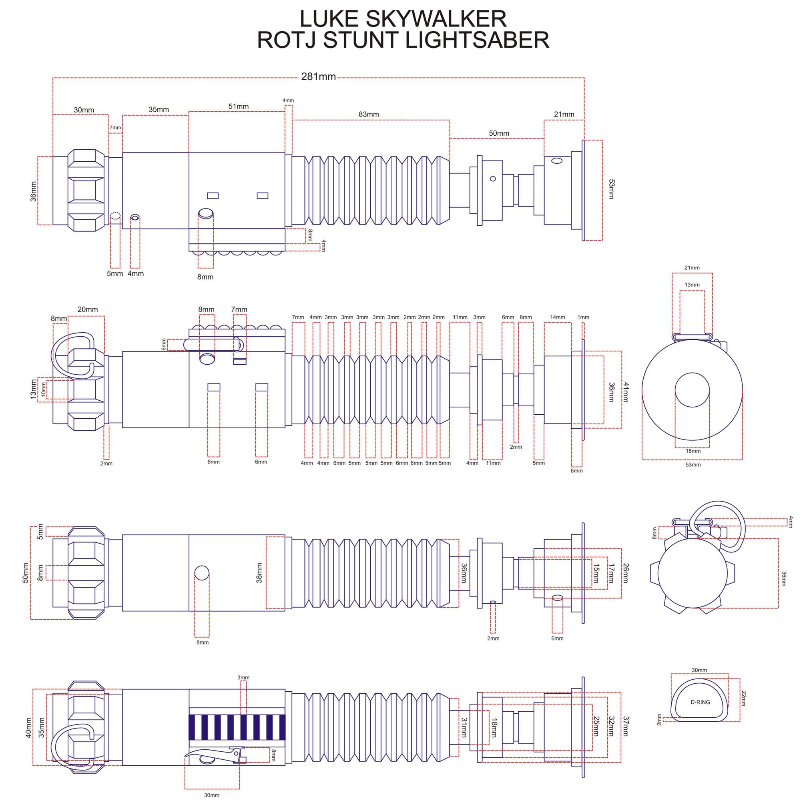

# Star Wars Lightsabers

### The original trilogy lightsaber collection built with HTML and CSS in Astro.
### [Live Site](https://sw-lightsabers.netlify.app)

## Blueprints Implemented

| Obi-Wan Kenobi ANH | Luke Skywalker ESB |
|----------|----------|
|  |  |

| Darth Vader ESB | Luke Skywalker ROTJ V2 |
|----------|----------|
|  |  |

## Commands

All commands are run from the root of the project, from a terminal:

| Command                   | Action                                           |
| :------------------------ | :----------------------------------------------- |
| `npm install`             | Installs dependencies                            |
| `npm run dev`             | Starts local dev server at `localhost:4321`      |
| `npm run build`           | Build your production site to `./dist/`          |
| `npm run preview`         | Preview your build locally, before deploying     |
| `npm run astro ...`       | Run CLI commands like `astro add`, `astro check` |
| `npm run astro -- --help` | Get help using the Astro CLI                     |